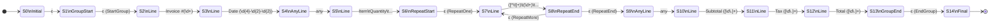

```mermaid
stateDiagram-v2
    direction LR

    %% States
    state "S0\nInitial" as S0
    state "S1\nGroupStart" as S1
    state "S2\nLine" as S2
    state "S3\nLine" as S3
    state "S4\nAnyLine" as S4
    state "S5\nLine" as S5
    state "S6\nRepeatStart" as S6
    state "S7\nLine" as S7
    state "S8\nRepeatEnd" as S8
    state "S9\nAnyLine" as S9
    state "S10\nLine" as S10
    state "S11\nLine" as S11
    state "S12\nLine" as S12
    state "S13\nGroupEnd" as S13
    state "S14\nFinal" as S14

    %% Transitions (no colons)
    [*] --> S0
    S0 --> S1: ε
    S1 --> S2: ε (StartGroup)
    S2 --> S3: Invoice #(\\d+)
    S3 --> S4: Date (\\d{4}-\\d{2}-\\d{2})
    S4 --> S5: *any*
    S5 --> S6: Item\\tQuantity\\t...
    S6 --> S7: ε (RepeatOne)
    S7 --> S8: ([^\\t]+)\\t(\\d+)\\t...
    S8 --> S7: ε (RepeatMore)
    S8 --> S9: ε (RepeatEnd)
    S9 --> S10: *any*
    S10 --> S11: Subtotal ([\\d\\.]+)
    S11 --> S12: Tax ([\\d\\.]+)
    S12 --> S13: Total ([\\d\\.]+)
    S13 --> S14: ε (EndGroup)
    S14 --> [*]
```
